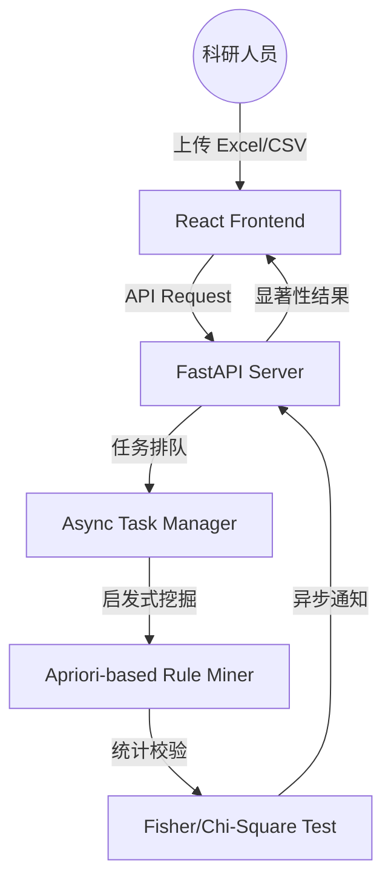

# 📊 BivaStat-Miner: 智能双变量关联挖掘与非参数统计分析平台

[](https://fastapi.tiangolo.com/)
[](https://reactjs.org/)
[](LICENSE)

**BivaStat-Miner** 是一个专为科学研究与数据探索设计的现代自动化分析平台。它融合了启发式关联规则挖掘算法与严谨的非参数统计检验，旨在为科研人员提供一键式、工业级的变量关联深度洞察。

---

## 📸 项目预览 (Screenshots)

> [!TIP]
> 部署完成后，请在这里替换为您真实的系统截图。

| 数据管理中心 | 智能挖掘配置 | 分析报告展示 |
| :---: | :---: | :---: |
|  |  |  |

---

## 🏗️ 系统架构 (Architecture)

本系统采用高效的异步计算架构，确保在大规模数据集下的流畅体验：



---

## 🔥 核心特性 (Key Features)

- **🧪 科学级显著性校验**：不同于常规挖掘工具，本平台对每一条挖掘出的规则自动执行 **Fisher 精确检验** 或 **卡方独立性检验**，确保结果具有统计学意义（P < 0.05）。
- **⚡ 启发式挖掘引擎**：基于优化的 Apriori 算法，自动剪枝无效搜索空间，秒级完成万级数据量的复杂关联计算。
- **🎨 Notion-Inspired UI**：极简清爽的交互设计，支持数据质量实时诊断、缺失值热力图及动态规则表格。
- **📊 自动化报告导出**：一键将挖掘出的显著性规则导出为科研标准的 CSV 数据报表。
- **🚀 异步计算架构**：采用线程池异步处理模式，前端实时轮询进度，避免长耗时任务导致的页面假死。

---

## 🛠️ 技术栈 (Tech Stack)

### Backend
- **Core**: Python 3.10+ & FastAPI
- **Data Engine**: Pandas & NumPy
- **Scientific Computing**: SciPy & Scikit-learn
- **Task Management**: Asyncio & ThreadPoolExecutor

### Frontend
- **Framework**: React 18 + TypeScript
- **Styling**: Tailwind CSS (Notion Aesthetic)
- **Icons**: Lucide-React
- **State Management**: React Hooks & Axios

---

## 🚀 快速开始 (Quick Start)

### 1. 克隆项目
```bash
git clone https://github.com/zsy-dream/BivaStat-Miner.git
cd BivaStat-Miner
```

### 2. 后端启动
```bash
# 安装依赖
pip install -r requirements.txt
# 运行
python main.py
```

### 3. 前端启动
```bash
cd frontend
npm install
npm run dev
```

---

## 🌐 在线访问

目前平台已上线，欢迎访问：
👉 [**stat-miner.zsypioneer.cn**](https://stat-miner.zsypioneer.cn)

---

## 📄 开源协议

本项目基于 **MIT License** 开源。

---

© 2026 BivaStat-Miner Project. 设计与开发：ZSY
